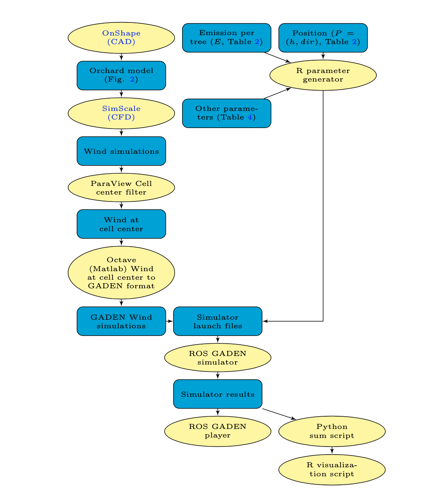

# GADEN steps and configuration

Table 1 summarizes the scenarios and numeric parameters used for modeling the environment.
Other general parameters necessary for the GADEN simulations are described in detail in Table
In Fig. 1 a general overview of the necessary steps of the simulation process is illustrated
including some of the processes described in the next section.

## Figure 1

The first step is the creation of the simulation environment, in this case using an online CAD
tool (OnShape). With the orchard model, using SimScale, an online
CFD simulator, an internal volume mesh was generated with 0.1 m resolution and with that,
several wind simulations were computed. ParaView is then used in conjunction with a Matlab
script to convert the wind simulations in OpenFOAM format to GADEN wind simulation files.
With an R script, 15 XML simulator launch files where generated with the parameters in Table 1
and the general settings in Table 4. The launch files are then used in the ROS GADEN simulator, 
that outputs the simulator results with ethylene concentration in ppm for each (x, y, z) and time step (t).

## Table 1

| Parameter                       | Description                                                                         | Unit          | Value  |
|---------------------------------|-------------------------------------------------------------------------------------|---------------|--------|
| specific_gravity             | Ethylene specific gravity                                                           | -        | 0.974 |
| sim_time                     | Total time of the gas dispersion simulation                                         | s          | 301    |
| time_step                    | Time increment between snapshots\. Set to cell size divided by maximum wind speed\. | s           | 0.1   |
| num_filaments_sec         | Number of filaments released each second\.                                          |               | 10     |
| filament_initial_std      | Sigma of the filament at t=0                                                        | cm          | 10     |
| filament_growth_gamma     | Growth ratio of the filament                                                        | cms^{-1} | 10     |
| filament_noise_std        | Range of the white noise added on each iteration                                    | m          | 0.02  |
| gas_type                     | Gas type Ethylene                                                                   |               | 10     |
| temperature                     | Air temperature                                                                     | K       | 298    |
| pressure                        | Atmospheric pressure                                                                | Pa          | 101325 |
| concentration_unit_choice | 0= molecules*cm^{-3}, 1=mg/L                                                |               | 1      |
| restuls_time_step         | Time increment between saving state to file                                         | s          | 15     |

